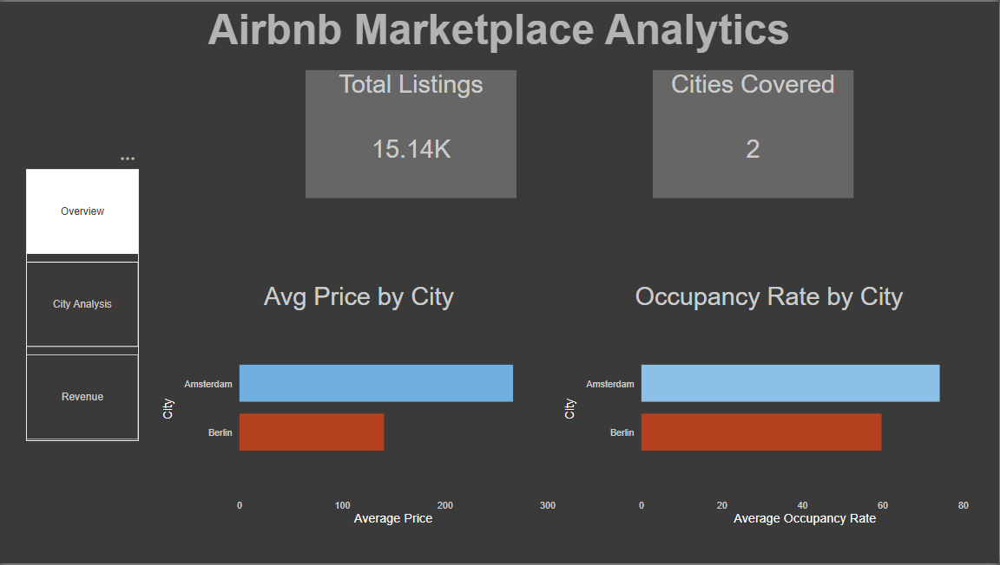
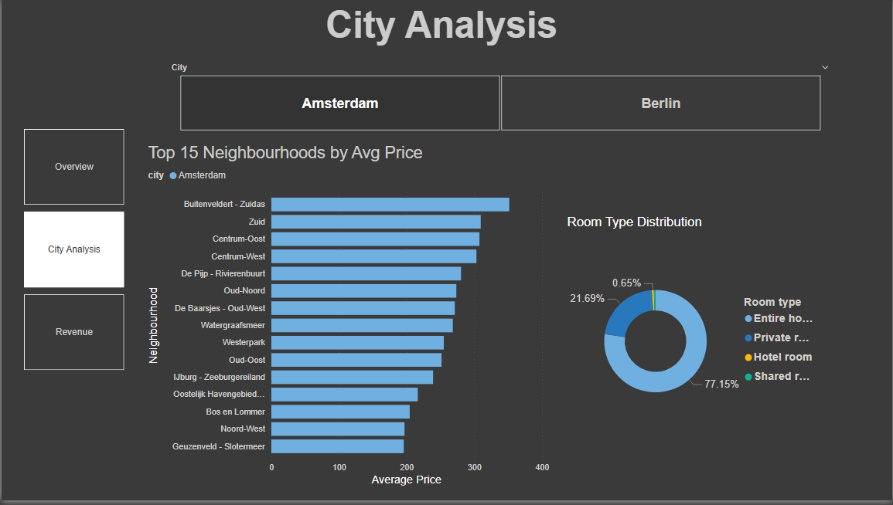
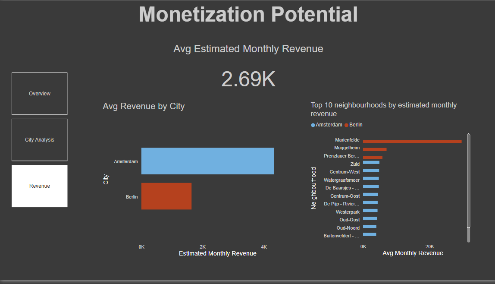

# Airbnb Marketplace Analytics Platform (Berlin vs Amsterdam)
An end-to-end analytics pipeline analyzing Airbnb marketplace performance across Amsterdam and Berlin using Python, MySQL, and Power BI.


## Project Overview

This project analyzes ~15,000 Airbnb listings across two major European cities to uncover pricing trends, occupancy patterns, and revenue potential by neighborhood. The goal is to simulate a real-world marketplace analytics workflow  from raw data ingestion to executive dashboards.


## Tech Stack
```
 Layer                       Tool 

 Data Cleaning & Loading     Python (Pandas, SQLAlchemy) 
 Data Storage                MySQL 
 Analytics & KPIs            SQL (Views) 
 Visualization               Power BI 
```


## Architecture

```
Data Source
   ↓
Inside Airbnb CSV datasets

Data Processing
   ↓
Python (Pandas)
• Data cleaning
• Schema normalization
• Load to MySQL

Data Storage
   ↓
MySQL relational database
• listings table
• calendar table

Analytics Layer
   ↓
SQL Views
• city_summary
• room_type_distribution
• top_neighbourhoods
• revenue_potential

Visualization Layer
   ↓
Power BI Dashboard
• Executive overview
• City-level analysis
• Revenue insights
```

## Dashboard Preview

### Overview


### City Analysis


### Revenue Analysis



## Dataset

- **Source:** [Inside Airbnb](http://insideairbnb.com/get-the-data/)
- **Cities:** Amsterdam, Berlin
- **Files:** listings.csv.gz, calendar.csv.gz
- **Total listings:** ~15,000
- **Calendar rows:** ~5 million+

---

## KPIs Calculated
```
 KPI                           Description  

- Average Price                 Mean nightly price per city 
- Occupancy Rate                % of days a listing is booked (1 - availability) 
- Top Neighbourhoods            Ranked by average nightly price |
- Room Type Distribution        % breakdown of Entire home vs Private room etc. 
- Estimated Monthly Revenue     avg_price × occupancy_days per month per listing 
```


## Dashboard Pages

### 1. Overview
- Total listings and cities covered
- Average price comparison: Amsterdam vs Berlin
- Occupancy rate comparison

### 2. City Analysis
- Interactive city slicer (filter all visuals by city)
- Top 15 neighbourhoods by average price
- Room type distribution (Entire home, Private room, Hotel room, Shared room)

### 3. Monetization Potential
- Average estimated monthly revenue
- Revenue comparison by city
- Top 10 highest-earning neighbourhoods

---

## Key Findings

- **Amsterdam** commands significantly higher average nightly prices than Berlin
- **Amsterdam** also has a higher occupancy rate, indicating stronger demand
- **Entire home/apt** listings dominate both cities (~74–77% of all listings)
- Top revenue-generating neighbourhoods in Amsterdam outperform Berlin's top areas by a wide margin
- **Marienfelde** (Berlin) is an outlier with unusually high estimated revenue

---

## Project Structure

```
MarketplaceAnalysis/
│
├── Amsterdam/
│   ├── listings.csv.gz
│   └── calendar.csv.gz
│
├── Berlin/
│   ├── listings.csv.gz
│   └── calendar.csv.gz
│
├── load_to_mysql.py          # Phase 1: Clean & load data into MySQL
├── phase2_kpi_views.sql      # Phase 2: KPI SQL views
├── MarketplaceAnalysis.pbix  # Power BI dashboard
└── README.md
```


## How to Run

### Prerequisites
- Python 3.8+
- MySQL 8.0+
- Power BI Desktop

### Steps

**1. Install dependencies**
```bash
pip install pandas sqlalchemy pymysql
```

**2. Configure database credentials**

Open `load_to_mysql.py` and update:
```python
MYSQL_USER     = "your_username"
MYSQL_PASSWORD = "your_password"
```

**3. Run the data pipeline**
```bash
python load_to_mysql.py
```

**4. Create KPI views**

Open MySQL Workbench, connect to `airbnb_analysis`, and run `phase2_kpi_views.sql`

**5. Open the dashboard**

Open `MarketplaceAnalysis.pbix` in Power BI Desktop. Refresh the data source if prompted.


## Data Source

Data is sourced from [Inside Airbnb](http://insideairbnb.com/get-the-data/), an independent project that provides publicly available Airbnb listing data for cities worldwide.

## Skills Demonstrated

- Data Cleaning and Transformation (Python, Pandas)
- Relational Data Modeling (MySQL)
- SQL Analytics and KPI Development
- Data Visualization (Power BI)
- End-to-End Data Pipeline Design

## Future Improvements

- Automate pipeline execution with scheduled jobs
- Expand analysis to additional European cities
- Implement demand forecasting using machine learning
- Deploy dashboard to Power BI Service
